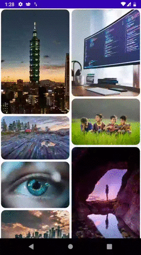
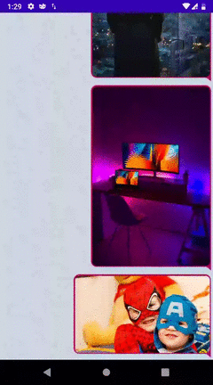

# AspectRatioImageView [](https://jitpack.io/#mehdiyari/AspectRatioImageView)

With this library, you can display photos with their original aspect ratio within any screen size.

## Demo




## Usage
### Gradle
Step 1. Add it in your root `build.gradle` at the end of repositories:
```gradle
allprojects {
  repositories {
	maven { url 'https://jitpack.io' }
  }
}
```
Step 2. Add the dependency
```gradle
dependencies {
  implementation 'com.github.mehdiyari:AspectRatioImageView:{latest_version}'
}
```
#### Gradle-Kotlin-DSL
Step 1. Add it in your root `build.gradle.kts` at the end of repositories:
```gradle
repositories {
  maven {
    this.url = URI("https://jitpack.io")
  }
}
```
Step 2. Add the dependency
```gradle
implementation("com.github.mehdiyari:AspectRatioImageView:{latest_version}")
```
### Maven
```xml
<repositories>
  <repository>
	 <id>jitpack.io</id>
	 <url>https://jitpack.io</url>
  </repository>
</repositories>
```
```xml
<dependency>
  <groupId>com.github.mehdiyari</groupId>
  <artifactId>AspectRatioImageView</artifactId>
  <version>{latest_version}</version>
</dependency>
```
### Simple usage
In XML
```xml
<ir.mehdiyari.ariv.ui.AspectRatioImageView
  android:layout_width="wrap_content"
  android:layout_height="wrap_content" 
  android:src="@drawable/photo"/>
```
In Code
```kotlin
// kotlin
AspectRatioImageView(this@MainActivity).apply { 
  setImageDrawable(ContextCompat.getDrawable(this@MainActivity, R.drawable.photo))
}
```
```java
// java
AspectRatioImageView aspectRatioImageView = new AspectRatioImageView(this@MainActivity);
aspectRatioImageView.setImageDrawable(ContextCompat.getDrawable(this@MainActivity, R.drawable.photo));
```
## Attributes
| Attribute name   | Type      | Description                                                      |
|------------------|-----------|------------------------------------------------------------------|
| ariv_minWidth    | dimension | Min width of ImageView                                           |
| ariv_maxWidth    | dimension | Max width of ImageView                                           |
| ariv_minHeight   | dimension | Min height of ImageView                                          |
| ariv_maxHeight   | dimension | Max height of ImageView                                          |
| ariv_adapterMode | boolean   | If you are using ariv inside<br> recyclerView set adapterMode to true|
| ariv_src         | reference | image source                                                     |

note: <br>
Because AspectRatioImageView used [RoundImageView](https://github.com/vinc3m1/RoundedImageView) as base 
imageview you can use all of attributes [RoundImageView](https://github.com/vinc3m1/RoundedImageView) too
## License

    Copyright 2020 Mehdi Yari

    Licensed under the Apache License, Version 2.0 (the "License");
    you may not use this file except in compliance with the License.
    You may obtain a copy of the License at

       http://www.apache.org/licenses/LICENSE-2.0

    Unless required by applicable law or agreed to in writing, software
    distributed under the License is distributed on an "AS IS" BASIS,
    WITHOUT WARRANTIES OR CONDITIONS OF ANY KIND, either express or implied.
    See the License for the specific language governing permissions and
    limitations under the License.
